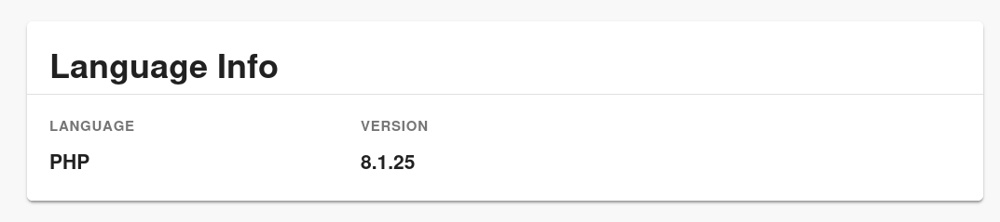

# Language info card

Add a card component that add language info on the "Overview" page.



# Getting started

1. Install the plugin

```
yarn add @hpatoio/language-info
```

2. Modify your entity page

Open `packages/app/src/components/catalog/EntityPage.tsx` and add

```tsx
import { EntityLanguageInfoCard } from '@internal/plugin-language-info';
```

then `EntityLanguageInfoCard` in `overviewContent`

```tsx
<Grid item md={6}>
   <EntityLanguageInfoCard />
</Grid>
```

2. Tag your component with the right tag

For example if you want to extract the PHP version add `php` tag.

```
apiVersion: backstage.io/v1alpha1
kind: Component
metadata:
  name: dummy-prj
  tags:
    - foo
    - php
    - bar
[...]
```

# Dependencies

This plugin requires `plugin-language-info-backend`.